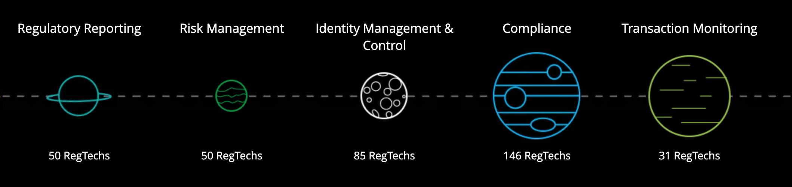

# The Unicorn in Wealth Management and Inclusive Finance

## Overview
Formerly known as Alipay, Ant Financial was rebranded and founded by Jack Ma in October 2014 in Hangzhou, China, now the world's highest-valued FinTech company. As a spin-off of Aplipay which well established its presence in virtual accounts and digital payments, Ant Financial, instead, has a bigger vision about microfinance. The foundational idea is to build a fair, transparent and open financial system by providing investment products to every small business and user. 

The symbolic meaning behind its name also explains the vision well: although ants seem small, working together they can achive something something impressive. This idea in reshaping financial system attracted wide interest from different investors. Ever since 2014 when it started, Ant Financial has raised more than $5 billion funding with giants in China including China Investment Corp (CIC), CCB Trust, China Life and China Post Group; in Jan 2017, it announced a deal to acquire MoneyGram International for $880 million, and later formed a joint venture with CK Hutchison Holdings to launch digital wallet services in Hong Kong. The company funded $14 billion more and expanded further in Southeast Asia. Nowadays it is the most valuable unicorn with $150 billion valuation, outstanding as the only Fintech among other bulge bracket banks in the top financial service firms. 

## Business Activities
Ant Financial covers several subsidiaries, including
* Alipay: A mobile wallet and payments app that can be kept account balance from users on in order to reduce transaction friction and invite investing opportunites
* *Yu'e Bao*: A feature in Alipay that allows users to invest with their remaining balance in funds, for example, Tianhong Fund with low risk and annual return 3.5%
* Sesame Credit: A third-party credit rating system based on big data that cooperates with business and provides different terms for users with good or poor credit scores
* *Ant Fortune*: A comprehensive wealth management app that deploys artificial intelligence power to offer tailor-made wealth management serice by teaming up asset management firms 

Comparing to other subsidaries, Ant Fortune grabs more my attention as a relatively new service that came out in 2017. The wealth management platform provides investment advice to users but not limit to high-net worth investors and portfolio managers. 

> We want to use technology to support asset management companies to come up with tailored
> products and make services more accessible to ordinary users, through better user
> connectivity and smart marketing.  <cite> Huang Hao, the president of Digital Finance
> Business Group at Ant Financial </cite>

As mentioned before, *Yu'e Bao*, money-market fund from Tianhong Fund, is the earliest investment product sold on the platform. The fund now has 600 million users. It is a crucial edge of Ant that Alipay users see it as a handy cash manament tool through virtual wallet, and mutually asset manament firms can better leverage users' payment and investment preferences to attract more investors. By June 2019, asset management companies had recorded an average 70 percent growth in the number of transacting users since they opened their accounts on Ant Fortune. The existing user base from Alipay along with win-win cooperation with asset managements firms becomes the unfair advantage that Ant Fortune utilizes. 

**Technology:** Artificial-Intelligence is one of the core driving forces of inclusive finance. Ant fortunes applies AI in understanding user demand, optimizing investment strategy, and matching user with investment advice. 

From answers of a questionnaire or other written or oral inputs, __Naturual Language Processing__ is used to interpret user's risk profile and tolerance, and match to the most suitable investment choice based on quantified factors. A common procedure can be like this: 

1. Users upload information through Alipay.
2. The system recognizes unstructured texts and stamps in the information with financial-level image recognition capabilities and understands the meanings of the information through NLP and health knowledge graphs.
3. The system extracts critical information for subsequent verification and reasoning to make decisions about investment management. 

Moreover,  __Human Computer Interaction__ is also important with introduction of virtual assistant on Ant's wealth management platform. In serving a plethora of users, scalability is fundamental in this process and requires freeing humans from the process to achieve automation. But on the other hand, human intervention is also necessary for the financial system to prevent disastrous risks or system errors. In such hybrid human-machine systems, Ant need to make sure that the machine prediction and decision-making can be explained, the automation algorithms can be monitored and interrupted, among others.  

## Landscape
Ant Fortune is a leading Fintech in wealth management in China with huge base of existing small users from Aplipay. The surge of Fintech has a hit on this landscape indeed. According to a McKinsey & Company report from June 2015, 40% to 45% of affluent consumers who changed their primary wealth management firm in the previous two years moved to a digitally-led firm. What’s more, a full 72% of investors under the age of 40 said they would be comfortable working with a virtual financial advisor. As we can see, the digitalized trend in wealth management and investment advising is definite. 

In China, a great threat from mobile world is WeChat with 100 million daily active users. *The Red Packet* launched for Lunar New Year is a killer feature in which users are able to transfer any amount of money to each other as New Year greeting. However, WeChat focused more on social network than investment management so Ant is not counter-attacking aggressively. In the U.S., there are quite a few wealth managers which also applies Fintech greatly in transforming their business. For example, Vanguard, Fidelity and Betterment. Recently in April 2020, a new joint venture between Ant and Vanguard has been approved by China Securities Regulatory Commission in which Ant holds 51% stake and Vanguard. The joint venture started offering an automated service called *“Bang Ni Tou”* (Help You Invest), to capture people with at least 800 yuan ($113) to place in mutual funds. It is clear to see the global agreement in seeing Fintech as the future of wealth management to a more inclusive extent. 

## Results
Ant's wealth management platform is fueled with big growth in the number of transaction users year by year. According to the corporate conference, AI pushed 70% increase in transactions from 2018 to 2019, and users who purchase automatic investment plan jumped 170%. There are many factors in evaluating success of companies in this domain, but most importantly, user size and user experience. Undoubtly that 330 million cumulative users in the platform is a huge advantage. However, so far the reviews were not as satisfying as expected. Some people complain that they are not ready for more complicated investment products, others argue that the social feature is not helful in learning about wealth managments from each other. Although facing many doubts and confusion from users, Ant Fortune still surpassed its competitors in terms of user base, idea in microfinance, and the potential to expanding into more small business through tech platforms. 

## Recommendations
Personally I would give two recommendations to Ant to continue thriving in this Fintech age. 

* More focus on the fairness of algorithm. 
Fairness in wealth management is not equivalent to standardization. Disadvantaged groups, such as females, minority groups, and low-income people, have the right to enjoy financial services equal to others. However, standardized methods easily and unknowingly lead to bias. Perfect fairness and the accuracy of algorithms are likely to collide because the need from investors can be so different. Apart from traditional input data such as account information, Ant could adapt more interactive ways such as games and pyschological test to analyze user's investment preference and risk tolerence. NLP and other statistical models, for example decision tree, can be used to predict personalities of different investors so that they are provided with a more tailored advice with more category and optionality. Data visualization is also important in improving user experience. For instance, a graph on historical performance on the recommended strategy would help users understand better and more willing to proceed with the strategy. 

* More investment on regulatory technology and security infrastructure. 
Amid all optimism, Ant could get hit by the regulatory curbs in China especially after P2P being swiped out due to regulation policy. It is obvious to see that a more strict and regulated financial system is coming due to Fintech disruption: Chinese government tightening the limits for Ant to issue ABS, *Yu'e Bao* asset growth also been slowing down due to cap on daily subscription and withdrawl limits. It is reasonable for authorities to be wary about systematic risk brought by fintech giants like Ant, but it is always better for the company to be ready for it sooner. Ant need to improve software solutions in areas of Regulatory Reporting, Risk Management, Identity Management & Control, Compliance, and Transaction Monitoring. These RegTechs are of great significance in Ant's future growth and can be achived via big data analytics, real-time report, cloud computing and digital due diligence. 

