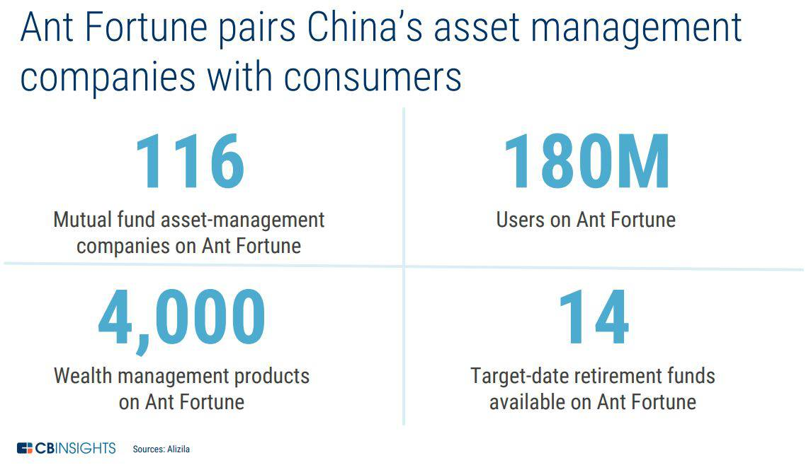

# The Unicorn in Wealth Management and Inclusive Finance

## Overview
Formerly known as Alipay, Ant Financial was rebranded and founded by Jack Ma in October 2014 in Hangzhou, China. As a spin-off of Aplipay which has established its strong presence in virtual accounts and digital payments, Ant Financial, now the world's highest-valued FinTech company, has a bigger vision in microfinance. The foundational idea of the company is to build a fair, transparent and open financial system by providing investment products to every small business. 

The symbolic meaning behind its name also well explains its vision: ants are small, but working together they can achive something something impressive. Ma's idea in reshaping financial system attracted wide interest from different investors. Ever since 2014, Ant Financial has raised more than $5 billion funding with giants in China including China Investment Corp (CIC), CCB Trust, China Life and China Post Group; in Jan 2017, it announced a deal to acquire MoneyGram International for $880 million, and later formed a joint venture with CK Hutchison Holdings to launch digital wallet services in Hong Kong. The company then funded billions more and expanded further in Southeast Asia. Nowadays it is the most valuable unicorn with $150 billion valuation, outstanding as the only Fintech among other bulge bracket banks in the top financial service firms. 

## Business Activities
Ant Financial covers several subsidiaries, including
* Alipay: A mobile wallet and payments app with account balance that helps reduce transaction friction and invite investing opportunites
* *Yu'e Bao*: A feature in Alipay that allows users to invest with their remaining balance in funds, for example, Tianhong Fund with annual return 3.5% and low risk in fixed-income assets
* Sesame Credit: A third-party credit rating system relying on big data as well as providing different business terms for users based on their scores
* Ant Fortune: A comprehensive wealth management app that deploys artificial intelligence power to offer tailor-made wealth management serice by teaming up asset management firms 

Comparing to other subsidaries, **Ant Fortune** grabs more my attention as a newer service that came out in 2017. The wealth management platform provides investment advice to users but not limit to high-net worth investors and portfolio managers. 

> " We want to use technology to support asset management companies to come up with tailored
> products and make services more accessible to ordinary users, through better user
> connectivity and smart marketing."  --- Huang Hao, the president of Digital Finance
> Business Group at Ant Financial

As mentioned before, *Yu'e Bao*, money-market fund from Tianhong Fund, is the earliest investment product sold on the platform. The fund now has 600 million users thanks to the success of *Yu'e Bao*. It is a crucial edge of Ant that virtual wallet is such a handy cash management tool for all the Alipay users. Mutually, asset manament firms can better leverage this user base in analyzing investment preferences in order to attract more investors. By June 2019, asset management companies had recorded an average 70% growth in the number of transacting users since they opened their accounts on Ant Fortune. The win-win teamwork between Ant and assetmanagment firms becomes the unfair advantage that other competitors can hardly match. 

**Technology:** Artificial-Intelligence is one of the core driving forces of inclusive finance. Ant Fortune applies AI in understanding user demand, optimizing investment strategy, and matching user with investment advice. 

From raw data from questionnaire or other inputs, __Machine Learning__ is used to interpret and model the risk profile of users, matching to the most suitable investment choice based on quantified factors. A common procedure can be like this: 

1. Users upload information through Alipay.
2. The system recognizes unstructured texts and stamps in the information with financial-level image recognition capabilities and understands the meanings of the information through NLP and health knowledge graphs.
3. The system extracts critical information for subsequent verification and reasoning to make decisions about investment management. 

Moreover,  __Human Computer Interaction__ is also a key technology Ant uses with introduction of virtual assistant. In serving a plethora of users, scalability is fundamental in this process and requires freeing humans from the process to achieve automation. But on the other hand, human intervention is also necessary for the financial system to prevent disastrous risks or system errors. In such hybrid human-machine systems, Ant need to make sure that the machine prediction and decision-making can be explained, the automation algorithms can be monitored and interrupted.  

## Landscape
Ant Fortune is a leading Fintech in wealth management in China with huge base of existing users from Aplipay. The surge of Fintech has a hit on this landscape indeed. According to a McKinsey & Company report from June 2015, 40% to 45% of affluent consumers who changed their primary wealth management firm in the previous two years moved to a digitally-led firm. What’s more, a full 72% of investors under the age of 40 said they would be comfortable working with a virtual financial advisor. As we can see, the digitalized trend in wealth management and investment advising is definite. 

In China, a great threat from mobile world is WeChat. This social App from Tencent has 100 million daily active users, and lauched *The Red Packet*, a killer feature in which users are able to transfer any amount of money to each other as New Year greeting. However, WeChat focused more on social network than investment management, so Ant is not counter-attacking aggressively. In the U.S., there are quite a few wealth managers which also applies Fintech greatly in transforming their business. For example, Vanguard, Fidelity and Betterment. Recently in April 2020, a new joint venture between Ant and Vanguard has been approved by China Securities Regulatory Commission in which Ant holds 51% stake and Vanguard holds 49%. The joint venture started offering an automated service called *“Bang Ni Tou”* (Help You Invest), to capture people with at least 800 yuan ($113) to place in mutual funds. It is a global agreement that Fintech is the future of wealth management and inclusive finance. 

## Results
The wealth management platform of Ant Financial is fueled with big growth in the number of transaction year by year. According to the corporate conference, AI pushed 70% increase in transactions from 2018 to 2019, and the number of users who purchase automatic investment plan jumped 170%. From the perspective of user base, there is no doubt that the 330 million cumulative users in the platform is a huge advantage and the number will keep increasing as more Aplipay users engage in investing. But from the perspective of user experience, the reviews were not as satisfying as expected. Some people complain that they are not ready for more complicated investment products, others argue that the social feature is not helpful in learning about wealth managments. Although facing challenge and uncertainty, Ant Fortune still surpassed its competitors in terms of huge user base, brilliant idea in microfinance, as well as advanced AI research and technology. 

## Recommendations
I would like to offer two recommendations to Ant Financial for continuously thriving in the Fintech age. 

* **More focus on the fairness of algorithm**   
Fairness in wealth management is not equivalent to standardization. Disadvantaged groups, such as females, minority groups, and low-income people, have the right to enjoy financial services equal to others. Perfect standardization and the accuracy of algorithms are likely to lead to bias because the need from investors can be so different. Therefore, apart from traditional input data such as account information, Ant could adapt more interactive ways such as games and pyschological test to get a comprehensive picture of user's background, preference and risk tolerence. NLP and decision trees can be used to predict personalities of different investors so that they are provided with more tailored advice. Once users are more willing to accept investment advice conceptually, data visualization is also important in helping understanding the products and improving user experience. For instance, a line plot on historical performance on the recommended strategy would help users understand better and more willing to proceed with the strategy. 

* **More investment on regulatory technology and security infrastructure**  
Amid all optimism, Ant could get hit by the regulatory curbs in China especially after P2P being swiped out due to regulation policy. It is obvious to see that a more strict and regulated financial system is coming as Fintech is more powerful: Chinese government tightening the limits for Ant to issue ABS, *Yu'e Bao* asset growth also been slowing down due to cap on daily subscription and withdrawl limits. Authorities have enough reason to be wary about Fintech like Ant given the systematic and macro risk that could disrupt the system in a second. If Ant wants to have a more forseeable future in China, the company need to improve software solutions in areas of Regulatory Reporting, Risk Management, Identity Management & Control, Compliance, and Transaction Monitoring. These RegTechs can be achived via big data analytics, real-time report, cloud computing and digital due diligence, which become significant in a more regulated financial environment. 

---
**Resources**: 
https://www.bloomberg.com/news/articles/2020-04-02/ant-vanguard-target-900-million-users-with-china-robo-adviser

https://hackernoon.com/the-story-of-ant-financial-4t2aq3zh8

https://www.alibabacloud.com/blog/ant-financial-applies-ai-in-financial-sector_595687

https://www.investopedia.com/tech/how-fintech-disrupting-wealth-management/

https://www2.deloitte.com/lu/en/pages/technology/articles/regtech-companies-compliance.html
